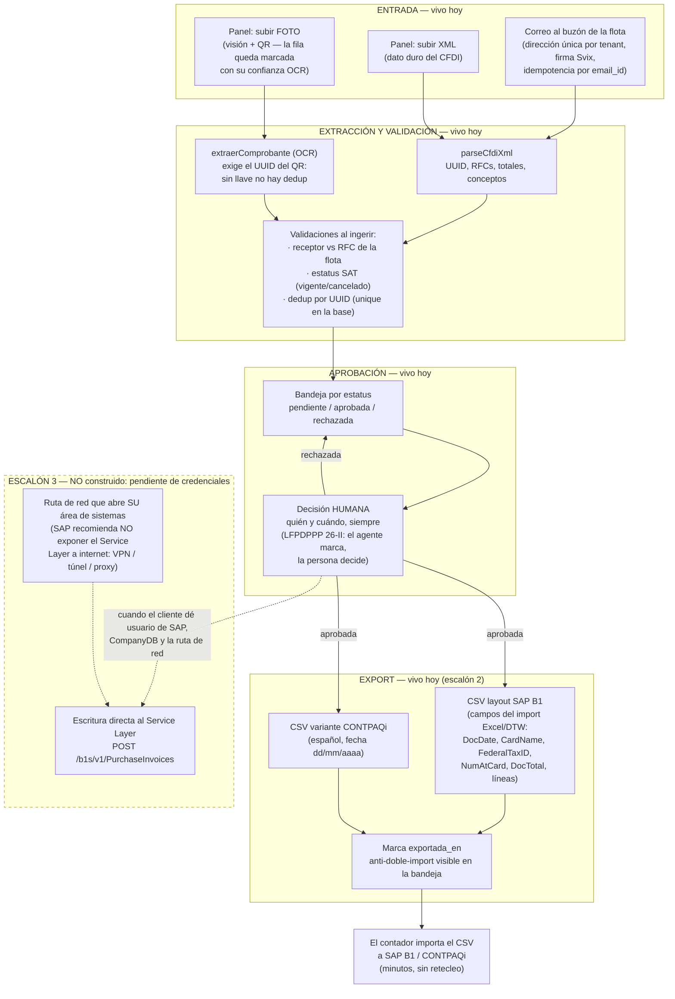

# Facturas de proveedor → SAP Business One — el flujo, con la verdad de cada tramo

Material de venta interna (Plaud #3, sesión con Transportes Innovativos).
Regla del documento: cada caja dice si **ya corre hoy** o si es **escalón 3,
pendiente de credenciales del cliente**. Nada de este diagrama se enseña como
vivo si aquí no lo dice.

Lo que pidió el cliente, en sus palabras: la factura del taller/refaccionaria
llega (correo o foto), la IA extrae los datos, los valida y los manda a
aprobación — y su SAP Business One se alimenta solo. **No quiere un ERP
nuevo.** Los escalones honran eso: primero el archivo que su SAP ya sabe
importar, después la escritura directa cuando nos den acceso.

## Qué está vivo hoy (verificable en el repo)

| Tramo | Dónde vive | Estado |
| --- | --- | --- |
| Buzón de correo por flota | `api/correo/entrante` + `buzon_escritura.ts` | Vivo: firma, tenant por destinatario, idempotencia, reintentos seguros |
| XML por panel | `dashboard/agentes/proveedores` | Vivo |
| Foto por panel (OCR) | `ingresarFacturaDesdeFoto` | Vivo; la fila carga `ocr_confianza` y la pantalla manda a revisar contra el papel |
| Estatus SAT al ingerir | `estadoSatDeCfdi` (ConsultaCFDIService) | Vivo; SAT caído → 'pendiente', nunca tumba el flujo |
| Aprobación humana con actor | `decidirFacturaProveedor` | Vivo; quién y cuándo en cada fila, candado anti-carrera |
| CSV SAP B1 / CONTPAQi | `/api/export/facturas-proveedor?formato=` | Vivo; marca `exportada_en` y anota la corrida del agente |
| Bitácora de corridas | `agente_corrida` (disparo `correo`/`manual`) | Vivo |

## Qué es escalón 3 y qué exige (no prometer sin esto)

1. **Credenciales del cliente**: dirección del Service Layer, `CompanyDB`,
   usuario y contraseña de SAP (el conector ya sabe probarlas:
   `conectores/erp.ts`, `SAP_B1.probar`).
2. **Ruta de red**: SAP documenta que el Service Layer es para llamadas
   internas — en un B1 instalado en la oficina, SU área de sistemas tiene que
   abrir VPN/túnel/proxy. Es trabajo de ellos, no nuestro, y se dice en la
   primera reunión, no en la segunda.
3. **Mapeo con su consultor**: `CardCode` (su catálogo de proveedores) y
   `TaxCode` (su catálogo fiscal) viven en SU SAP. En el CSV salen vacíos a
   propósito; en la escritura directa se resuelven contra sus catálogos
   leídos por el mismo Service Layer.

## Las frases para la venta (todas verdad)

- "Tu SAP no se toca: te damos HOY el archivo que tu SAP ya sabe importar."
- "La IA extrae y valida; la aprobación es de tu gente, siempre, con nombre
  y fecha."
- "Un CFDI cancelado ante el SAT no llega callado a tu contabilidad: la
  bandeja lo grita antes de que alguien lo apruebe."
- "La escritura directa a tu SAP es el siguiente paso y se activa con
  accesos que tú controlas — no la vendemos como si ya corriera."
